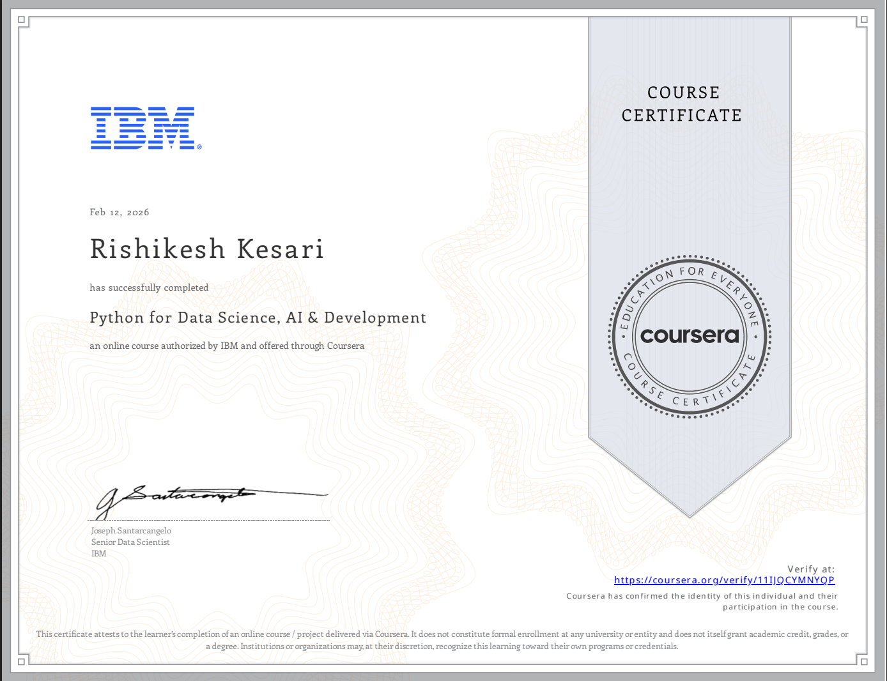

# IBM Python for Data Science, AI and Development
# 

    

## Overview

This repository documents completion of the IBM *Python for Data Science, AI and Development* course and summarizes the core Python competencies reinforced through structured coursework and hands on exercises.

The focus of this repository is competency documentation rather than standalone project development.

---

## Course Coverage

The course is structured into five modules covering foundational and applied Python skills:

**1. Python Basics**  
Syntax, variables, data types, expressions, and string operations.

**2. Data Structures**  
Lists, tuples, dictionaries, sets, and structured data manipulation.

**3. Programming Fundamentals**  
Control flow, loops, functions, exception handling, and object oriented programming principles.

**4. Working with Data**  
File input and output operations, CSV and JSON handling, and data manipulation using Pandas.

**5. APIs and Data Collection**  
REST API interaction using the requests library, JSON parsing, and web scraping using BeautifulSoup.

---

## Core Competencies Reinforced

- Structured Python programming
- Efficient use of built in data structures
- Control flow and functional abstraction
- Object oriented design fundamentals
- File handling and structured data processing
- Data manipulation using Pandas
- API integration and JSON data handling
- Web scraping for data acquisition

---

## Hands-on Experience with projects

This certification reinforces foundational Python proficiency aligned with data analysis and data engineering workflows.

Checkout some awesome hands-on project made by me– Applied analytics, machine learning and large scale data processing projects implemented in Python here: 
- [Clash Royale Game Data Analysis(https://github.com/rishianalytics/Clash_Royale_Game_Analysis/blob/main/Copy_of_Clash_Royale_Data_Intern_Test.ipynb) 
- [ESG Analysis Using Python](https://github.com/rishi-analytics/ESG-Specialization-Project-Portfolio/blob/main/ESG_Data_Analysis.ipynb)
- [Machine Learning with PySpark](https://github.com/rishi-analytics/Machine-Learning-With-PySpark)

---

## Certification

Verify the certifiction [here](https://www.coursera.org/account/accomplishments/verify/11IJQCYMNYQP)
